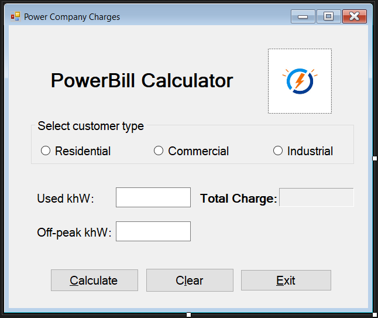

# CPRG-200-Lab1

Create a C# application that calculates a customer bill for the city power company. The Calculation will be
done for one customer at a time.

The rates vary depending on the customer type: residential, commercial, or industrial:
• Residential: $6.00 plus $0.052 for each kWh used ($6.00 is charged even when kWh usage is
zero).

• Commercial: Flat rate of $60.00 for the first 1000 kWh used (or part of, even when zero), and
$0.045 for each additional kWh.

• Industrial: Rate depends on whether usage occurred during peak hours or off-peak hours:

o Peak hours: Flat rate of $76.00 for the first 1000 kWh used (or part of, even when zero),
and $0.065 for each additional kWh.

o Off-peak hours: Flat rate of $40.00 for the first 1000 kWh used (or part of, even when
zero), and $0.028 for each additional kWh.

